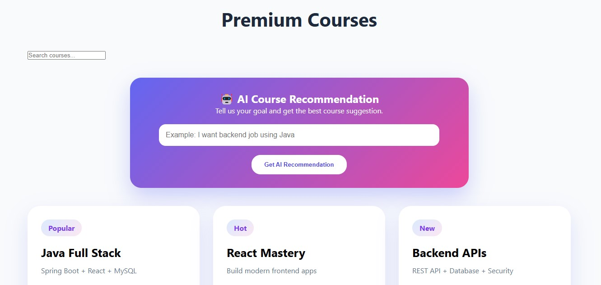
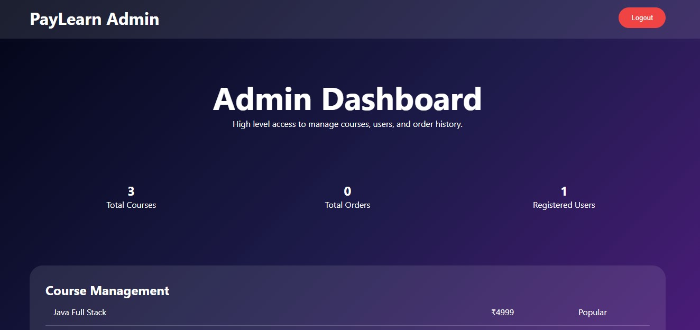

# 🚀 PayLearn - Online Course Platform

PayLearn is a modern full-stack online course platform built to provide a secure, interactive, and user-friendly learning experience for students and administrators.

## ✨ Features

- User Signup & Login
- Admin Dashboard
- Course Management
- Course Search
- Buy Now Flow
- Payment Workflow
- Bill Generation
- Order History
- Responsive UI

## 🛠️ Tech Stack

- React.js
- Spring Boot
- MySQL
- CSS
- Razorpay / Demo Payment Flow

# 📸 Project Screenshots

## 🤖 AI Recommendation


## 👨‍💼 Admin Dashboard


## 🏠 Homepage


## 📚 Course Section


## 🔐 Login Page


## 🔑 Signup Page

## ▶️ Run Frontend

```bash
cd payment-frontend
npm install
npm start
```

## ▶️ Run Backend

```bash
./mvnw spring-boot:run
```

## 🌟 Project Goal

This project demonstrates full-stack development skills, frontend-backend integration, authentication flow, payment workflow, admin access, responsive design, and real-world project structure.